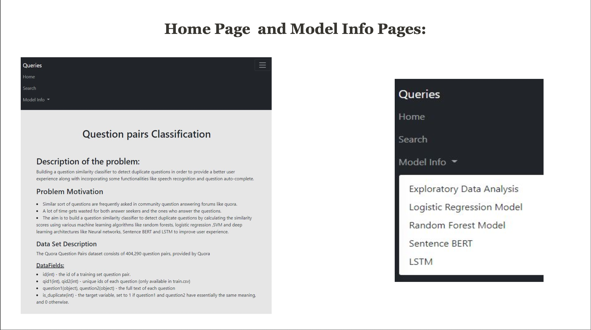
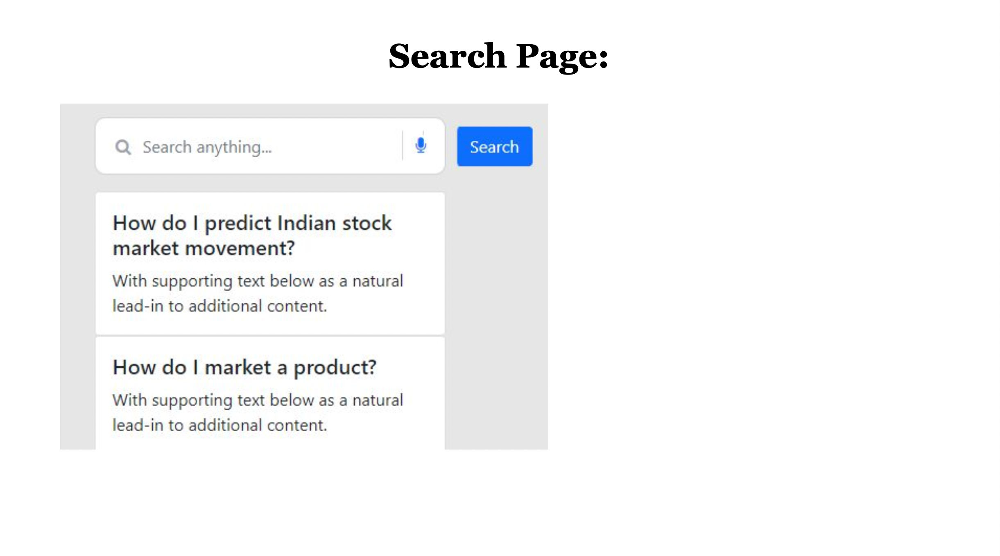

# Question Similarity Web Application

## Introduction
In community question answering forums similar sort of questions are frequently asked. The answer seekers have to wait for their questions to be answered and the ones who answer the question need to provide answers for already answered similar questions again. So a lot of time gets wasted. The main aim is to build a question similarity classifier to detect duplicate questions by calculating similarity scores using various ML algorithms like SVM, Random Forests and Logistic Regression and deep learning architectures like Sentence BERT and Manhattan LSTM. After training all the models, the model with the highest accuracy(Sentence BERT) is selected as the base model and we have created templates for each model to navigate from the base model. All the models are integrated into an user interactive web application using the Flask framework. Functionalities like Grammar Check, Question Autocomplete and Speech Recognition are also incorporated into the web application.

## Dataset Details
The Quora Question Pairs dataset consists of 404,290 question pairs, provided by Quora 1.

__Data Fields:__

- id(int) - the id of a training set question pair
- qid1(int), qid2(int) - unique ids of each question (only available in train.csv)
- question1(object), question2(object) - the full text of each question
- is_duplicate(int) - the target variable, set to 1 if question1 and question2 have essentially the same meaning, and 0 otherwise

## Approach

 We started by building the ML and DL models for question similarity on the quora question pairs dataset. After training we kept the model with highest accuracy as the base model and integrated these models into a web application using the Flask framework. The models and templates are routed using the app.py file. Once we had our frontend running on the localhost, we hosted the application on the worldwide web. We used Ngrok for hosting as a public webapp. 

## Screenshots of Home, Model Info and Search Page

## Hosting the Web Application
The Application is launched by web app

app.py is the main flask application and it has the basemodels and templates which is routed by using app.py file.

changing the below line before hosting the application. if name == "main": app.run(debug = True)

changing the below line before hosting the application.

if name == "main": app.run(host='0.0.0.0', port=80)

Docker commands to create image : FROM jupyter/scipy-notebook COPY ./app.py /deploy/ COPY ./requirements.txt /deploy/ COPY ./newfile.pkl /deploy/ COPY ./templates /deploy/templates COPY ./Static /deploy/Static WORKDIR /deploy/ RUN pip install -r requirements.txt EXPOSE 80 ENTRYPOINT ["python", "app.py"]

Commands to commit for AWS ec-2 : sudo yum install docker sudo dockerd sudo docker pull datasquad/qspredictions:latest sudo docker run -p 80:80 datasquad/qspredictions:latest
Ngrok Commands to execute for hosting as a public webapp : cmd: ngrok config add-authtoken 2ChlR8d9qnFAYm1rCnc5rpi3i72_5TuyqQx2RpBdidFGXKXhM cmd: ngrok http 80
